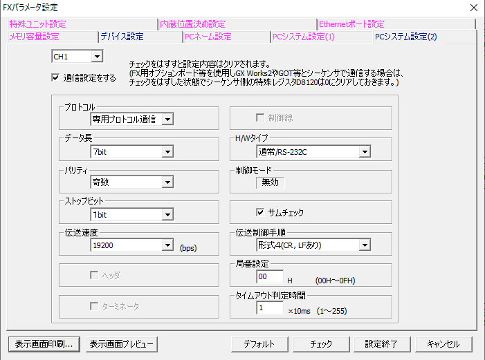
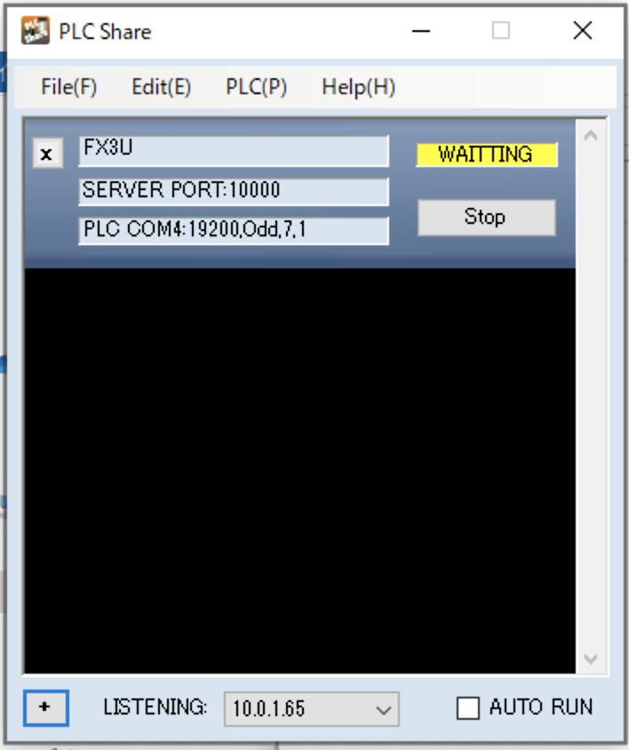

# PlcAccess

PlcAccess is library to make connection with PLCs.

## Installation

Add this line to your application's Gemfile:

```ruby
gem 'plc_access'
```

And then execute:

    $ bundle install

Or install it yourself as:

    $ gem install plc_access

## Usage


Mitsubishi MC Protocol:

```
require 'plc_access'

plc = PlcAccess::Protocol::Mitsubishi::McProtocol.new host:"192.168.0.10"

plc["M0"] = true
plc["M0"]         # => true
plc["M0", 10]     # => [true, false, ..., false]

plc["D0"] = 123
plc["D0"]         # => 123
plc["D0", 10] = [0, 1, 2, ..., 9]
plc["D0".."D9"]   # => [0, 1, 2, ..., 9]
```

Keyence PLCs:

```
require 'plc_access'

plc = PlcAccess::Protocol::Keyence::KvProtocol.new host:"192.168.0.10"

plc["MR0"] = true
plc["MR0"]         # => true
plc["MR0", 10]     # => [true, false, ..., false]

plc["DM0"] = 123
plc["DM0"]         # => 123
plc["DM0", 10] = [0, 1, 2, ..., 9]
plc["DM0".."DM9"]  # => [0, 1, 2, ..., 9]
```

### Types

If you want to read or write the value as a specified type, use to_ushort, to_short, to_uint, to_int, and to_float for reading and as_ushort, as_short, as_uint, as_int, and as_float for writing.   
And don't forget to put the line ```using PlcAccess::ActAsType``` before using it.

```
using PlcAccess::ActAsType

# [0, 1, 2, 3, 4] is treated as five int elements.
# #as_int converts int to two ushort elements. So it gets the total as ten ushort elements.

plc["DM0", 10] = [0, 1, 2, 3, 4].as_int  # => [0, 0, 1, 0, 2, 0, 3, 0, 4, 0]

# plc["MR0", 10] returns as ten ushort elements.
# #to_int converts two ushort values to one int value. So it gets the total as five int elements.

plc["MR0", 10].to_int # => [0, 1, 2, 3, 4]

# Set string to data memory (ten words from DM0) as ushort values.
# The byte order for string conversion differs by PLC type
# (e.g., Mitsubishi uses little-endian, Keyence/Omron use big-endian).
# Pass plc to automatically use the correct byte order.
plc["DM0", 10] = "PLC Access".as_ushort(plc)
# Get string from data memory (ten words from DM0).
plc["DM0", 10].to_string(plc)

# You can also specify the length and plc together.
plc["DM0", 5] = "PLC Access".as_ushort(10, plc)
plc["DM0", 5].to_string(10, plc)

```

## Supported PLCs

### Keyence

It supports Keyence PLCs with an Ethernet connection.

```
plc = PlcAccess::Protocol::Keyence::KvProtocol.new host: '192.168.0.10', port: 8501
```

### Mitsubishi

It supports Mitsubishi PLCs with an Ethernet connection.

```
plc = PlcAccess::Protocol::Mitsubishi::McProtocol.new host: '192.168.0.10', port: 5010
```

It supports Mitsubishi Fx PLCs with a Serial connection.

```
plc = PlcAccess::Protocol::Mitsubishi::FxProtocol.new port: /dev/tty.usbxxxxx'
```

PLC configuration:
- baudrate: 19200
- bit: 7
- parity: Odd
- stop bit: 1



### Omron

It supports Omron PLCs with an Ethernet connection.

```
plc = PlcAccess::Protocol::Omron::FinsTcpProtocol.new host: '192.168.0.10', port: 9600
```

It supports Omron PLCs with a C Mode serial connection.

```
plc = PlcAccess::Protocol::Omron::CModeProtocol.new port: /dev/tty.usbxxxxx'
```

### Plc Share

Plc Share is a protocol conversion application. It runs on Windows and connects to various PLCs using a serial or Ethernet connection. You can then connect with the Plc Share Protocol, which extends Keyence’s protocol. You can specify a target PLC’s device.

[Plc Share](http://iphone.itosoft.com/plcshare)



```
plc = PlcAccess::Protocol::PlcShare::PlcShareProtocol.new host: '192.168.0.10', port: 10000, device_type: :fx
```

You can choose a target PLC by using the device type option.

|device_type|Target PLCs|
|:-:|:--|
|:kv|Keyence PLCs|
|:fx|Mitsubishi Fx PLCs|
|:q|Mitsubishi Q/L/R PLCs|
|:omron|Omron PLCs|


## Contributing

Bug reports and pull requests are welcome on GitHub at https://github.com/ito-soft-design/plc_access. This project is intended to be a safe, welcoming space for collaboration, and contributors are expected to adhere to the [code of conduct](https://github.com/ito-soft-design/plc_access/blob/master/CODE_OF_CONDUCT.md).


## License

The gem is available as open source under the terms of the [MIT License](https://opensource.org/licenses/MIT).

## Code of Conduct

Everyone interacting in the PlcAccess project's codebases, issue trackers, chat rooms and mailing lists is expected to follow the [code of conduct](https://github.com/ito-soft-design/plc_access/blob/master/CODE_OF_CONDUCT.md).
